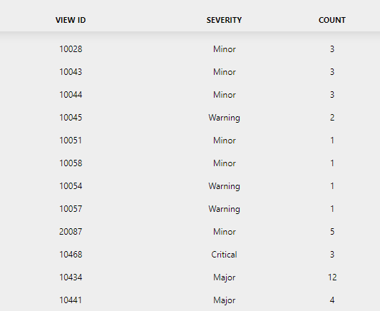

# Highest severity alarm count per view

Fetches the alarm count of the highest severity per view.

This results in a table with multiple columns:

- View ID
  - An integer column identifying the view ID
- Severity
  - A string column identifying the severity of the alarm count of that view.
- Count
  - An integer column identifying the alarm count (for the specific severity per view).

## Arguments

This data sources comes with 1 argument:

- Filter: The name of the public alarm filter.

